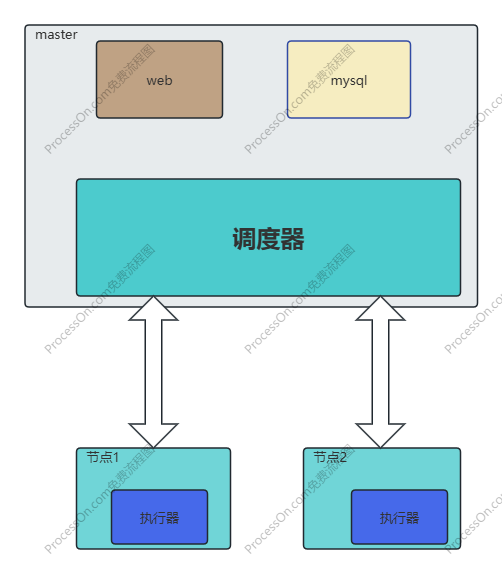
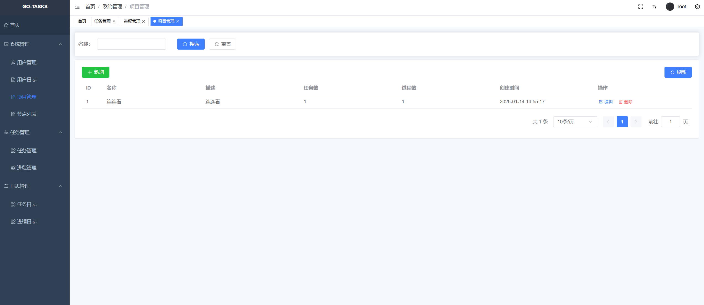
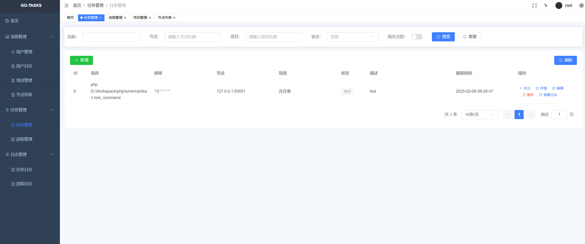
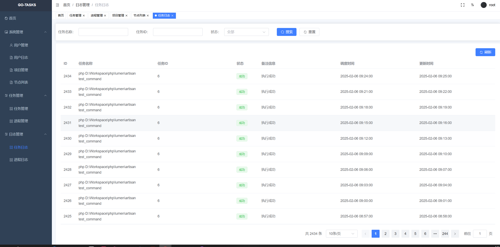
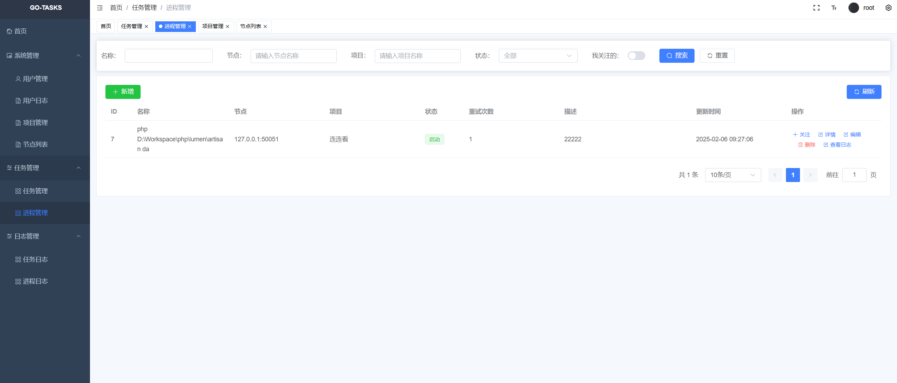
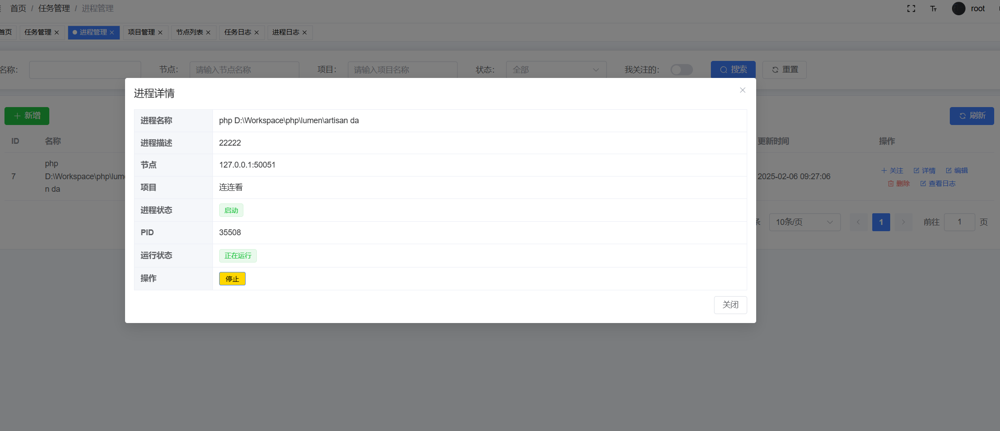

## go-tasks
基于golang开发的分布式任务调度中心、进程管理中心

## 项目特色

- **简洁易用**：多项目、多节点部署，基于golang二进制安装，无需配置运行环境

- **任务统一管理，多节点执行**：所有任务通过web界面统一管理，然后调度到各执行器执行，免去cron等类似服务的复杂操作。

- **内置进程管理**：内置守护进程管理功能，轻松应对若干异步进程需求。

## WEB界面图
 
 
 

## WEB界面图

